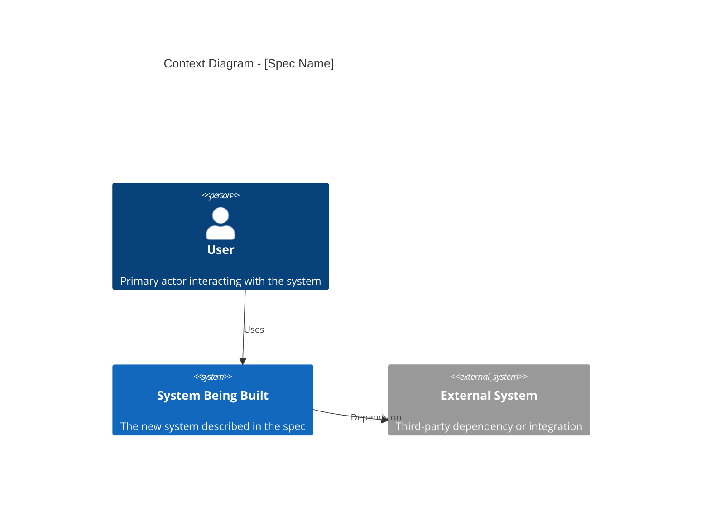
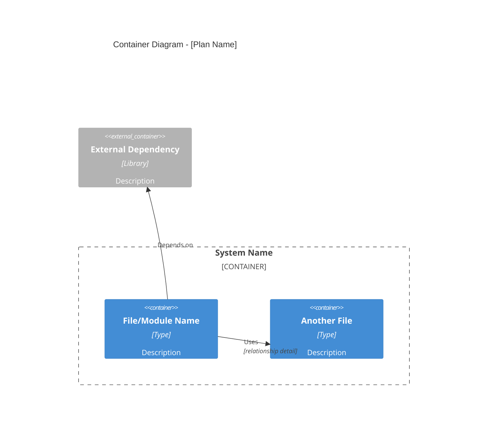
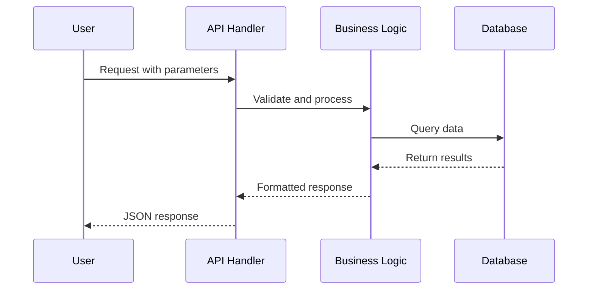

# C4 Diagram Generator for Implementation Plans

This skill generates C4 model diagrams using Mermaid syntax from implementation plan specifications (created via `writing-plans` or similar). It produces **exactly three** diagrams:

1. **Container Diagram** (C4Container) — High-level file structure and dependencies
2. **Component Diagram** (C4Component) — Main classes and their relationships (high-level only)
3. **Sequence Diagram** (sequenceDiagram) — Runtime execution flow showing how the solution works when used

**CRITICAL: Generate exactly 3 diagrams total. No task flows, no detailed component breakdowns, no multiple variants.**

## When to Use This Skill

- User asks to visualize an implementation plan or design spec
- User mentions "C4 diagram", "architecture diagram", "flow diagram"
- You're creating a new implementation plan with `writing-plans` (auto-include diagrams when warranted)
- You're writing a design spec via `brainstorming` that has multi-component or service-level architecture (spec mode)
- User wants to understand the structure of a complex plan or spec at a glance

## Output Modes

**Standalone mode**: Generate diagrams as a separate `.md` file when explicitly requested.

**Integrated mode — plan**: When called during plan creation (via `writing-plans`), embed all three diagrams inside the `# Architecture Overview` section of the plan document, under `## Architecture Diagrams`.

**Integrated mode — spec**: When called during spec writing (via `brainstorming`), append a `## Architecture Diagrams` section to the spec document. Produces **2 diagrams only**: Context Diagram + Container Diagram. Sequence diagrams are omitted — runtime detail is not yet defined at spec time.

## Implementation Plan Conventions → C4 Mapping

### File Structure Table Patterns

The "File Structure" section in plans typically looks like:

```markdown
| Action | File | Responsibility |
|--------|------|---------------|
| Modify | atlas/measurement/utils/sample_size.py | Add AlphaCorrectionMethod enum, ... |
| Create | tests/test_pairwise_sample_size.py | All pairwise comparison tests |
```

**Mapping rules:**
- **Container level**: Each unique file → Container
- **Component level**: Extract class/function names from "Responsibility" column → Components within containers
- "Modify" → Existing container
- "Create" → New container

### Architecture Section Patterns

Look for paragraphs describing:
- "New `ClassName` class inheriting from `BaseClass`" → Component with inheritance relationship
- "Extends the X library's Y module" → External system dependency
- "Uses `FunctionName()` to compute..." → Component dependency

### Spec Document Patterns (brainstorming spec mode)

Design specs don't have file structure tables. Extract architecture from the narrative prose:

- **Actors / end users** described in the spec → Context Diagram `Person` nodes
- **External services, third-party APIs, or integrations** → `System_Ext` nodes
- **Main subsystems, services, or modules being built** → `Container` nodes
- **"communicates with", "calls", "sends data to", "depends on"** language → `Rel` arrows

For the Context Diagram: focus on the system boundary — what is being built, who uses it, and what external systems it depends on.
For the Container Diagram: focus on the main internal components and how they interact.

## Mermaid C4 Diagram Syntax Reference

Consult the official Mermaid C4 documentation for correct syntax: https://mermaid.js.org/syntax/c4.html

### Context Diagram Template (spec mode only)



**Key elements:**
- `Person(id, label, description)` for human actors
- `System(id, label, description)` for the system being built
- `System_Ext(id, label, description)` for external systems or services
- Keep it high-level: 2–5 nodes total

### Container Diagram Template



**Key elements:**
- `Container(id, label, type, description)` for files/modules
- `Container_Boundary` to group related files (e.g., by directory)
- `Container_Ext` for external libraries/systems
- `Rel(from, to, label, detail)` for relationships

### Component Diagram Template

```mermaid
C4Component
    title Component Diagram - [Plan Name]
    
    Component_Boundary(module1, "File/Module Name") {
        Component(class1, "MainClass", "Class", "Core responsibility")
        Component(class2, "HelperClass", "Class", "Supporting responsibility")
    }
    
    Component_Boundary(module2, "Another Module") {
        Component(class3, "BaseClass", "Class", "Base functionality")
    }
    
    Rel(class1, class2, "Uses")
    Rel(class1, class3, "Inherits from")
```

**IMPORTANT**: Use `Component_Boundary` (NOT `Container_Boundary`) for component diagrams.

**Key elements:**
- `Component(id, label, type, description)` for **classes ONLY**
- Do NOT add enums, models, or utility types
- `Component_Boundary` groups classes within their file/module
- `Rel` for main relationships only: "Uses", "Inherits from"
- Keep it minimal: 4-8 classes, 3-6 arrows maximum

### Sequence Diagram Template

Use standard Mermaid sequence diagrams (NOT C4Dynamic) to show runtime interactions:



**Purpose**: Show the step-by-step execution when someone USES the implemented feature.

**ABSOLUTELY FORBIDDEN:**
- Any diagram about implementation tasks, development steps, or "how to build it"
- Diagrams titled "Task Flow", "Implementation Sequence", "Development Steps"
- Any mention of "Task 1", "Task 2", "Task 3", or numbered implementation phases

## Step-by-Step Generation Process

### Step 1: Parse the Implementation Plan

Read the plan file and extract:

1. **Plan metadata**: Goal, architecture summary, tech stack
2. **File structure table**: Actions (Modify/Create), file paths, responsibilities
3. **Architecture description**: Key classes, inheritance, dependencies
4. **Workflow hints**: Main use cases or data flows described in the goal/architecture

### Step 2: Generate Container Diagram

1. Identify all unique files from the file structure table
2. Group files by directory into `Container_Boundary` blocks
3. Add external dependencies mentioned in the architecture section as `Container_Ext`
4. Draw relationships based on:
   - Import statements described in tasks
   - "Uses", "extends", "depends on" language in responsibilities
   - Files that test other files (test file → implementation file)

### Step 3: Generate Component Diagram

**Focus on classes only - keep it simple and clear.**

1. Extract **class names only** from:
   - Task titles (e.g., "Add `PairwiseSampleSizeEstimation` class")
   - Responsibility descriptions mentioning classes
   - Architecture section describing main classes
2. **Do NOT include**: Enums, data models, small utility types, or configuration objects
3. Place each class component in its parent file's `Component_Boundary`
4. Draw **only the main relationships**:
   - Inheritance (when a class extends another)
   - Primary dependencies (when a class uses another class as a core collaborator)
   - **Avoid**: detailed method-level connections, validation relationships, utility usage
5. Keep the diagram minimal - 4-8 classes maximum with 3-6 arrows total

### Step 4: Generate Sequence Diagram

**Show how the IMPLEMENTED SOLUTION executes at runtime using a standard Mermaid sequence diagram.**

This diagram answers: "When someone uses this feature, what happens step-by-step?"

1. **Identify participants**: The main actors in the runtime flow
   - User/Client (who initiates)
   - API/Handler (entry point)
   - Service/Logic classes
   - Database/External systems

2. **Show the execution sequence**: Use standard sequence diagram syntax
   - Start with user/client action
   - Show method calls between participants with `->>` arrows
   - Show returns with `-->>` dashed arrows
   - Keep it to 6-12 key steps

3. **Use standard Mermaid sequenceDiagram syntax** (see https://mermaid.js.org/syntax/sequenceDiagram.html)

**Example titles:**
- "Sample Size Calculation Execution"
- "User Profile Retrieval Flow"  
- "ETL Pipeline Execution"

**ABSOLUTELY FORBIDDEN - DO NOT CREATE:**
- Task implementation flows showing "Task 1", "Task 2", "Task 3"
- Development/build sequences
- Any diagram about HOW TO IMPLEMENT (only show HOW IT EXECUTES)

### Step 5: Format Output

**For standalone mode:**
```markdown
# Architecture Diagrams - [Plan Name]

Generated from: `[path/to/plan.md]`

## Container Diagram

[Container diagram mermaid block]

## Component Diagram

[Component diagram mermaid block]

## Dynamic Diagram

[Dynamic diagram mermaid block]
```

**For integrated mode — plan (writing-plans):**
Provide the `## Architecture Diagrams` block to be inserted inside the `# Architecture Overview` section of the plan:

```markdown
## Architecture Diagrams

### Container Diagram

[Container diagram mermaid block]

### Component Diagram

[Component diagram mermaid block]

### Dynamic Diagram

[Dynamic diagram mermaid block]
```

**For integrated mode — spec (brainstorming):**
Append to the spec document:

```markdown
## Architecture Diagrams

### Context Diagram

[Context diagram mermaid block]

### Container Diagram

[Container diagram mermaid block]
```

## Tips for High-Quality Diagrams

### Container Diagrams
- Group files by directory structure (e.g., `src/`, `tests/`)
- Use consistent container types: "Python Module", "Test Suite", "SQL Script"
- Focus on key architectural dependencies, not every import
- Include the working directory boundary if specified in the plan

### Component Diagrams
- **CLASSES ONLY** - no enums, no data models, no small types
- **ONE diagram only** - high-level view, no detailed breakdowns
- Limit to 4-8 classes maximum
- Show only main relationships: inheritance and primary dependencies
- Minimize arrows: 3-6 total connections showing core architecture only
- NO separate detailed component diagrams (e.g., "Component Detail - SpecificClass")

### Sequence Diagrams
- Use standard Mermaid `sequenceDiagram` syntax (NOT C4Dynamic)
- Show **how the implemented solution executes when used**
- 6-12 steps showing participant interactions
- Use `->>` for calls, `-->>` for returns
- **Generate exactly ONE sequence diagram**
- **ABSOLUTELY FORBIDDEN: Task flows, implementation steps, development sequences**

### General
- Use clear, concise labels
- IDs must be alphanumeric: use underscores, not dots/slashes
- Sanitize file paths for IDs: `src/utils/helper.py` → `src_utils_helper_py`
- Verify syntax against https://mermaid.js.org/syntax/c4.html

## What NOT to Include

**Do NOT generate these extra sections:**
- Testing Strategy
- Extensions and Future Work  
- Performance Considerations
- Academic References

**Only include:**
- **Exactly 3 diagrams total**:
  1. Container Diagram (C4Container) - file structure
  2. Component Diagram (C4Component) - high-level classes only
  3. Sequence Diagram (sequenceDiagram) - runtime execution flow
- Brief diagram title/description if helpful
- **NO task flows or implementation sequences**
- **NO detailed component breakdowns** (e.g., "Component Detail - ClassName")
- **NO multiple variants or alternative views**

**If you find yourself creating more than 3 diagrams, STOP. Only generate the 3 diagrams listed above.**

## Error Handling

**If the plan is malformed or missing key sections:**
- Generate what you can from available information
- Add a note: "Note: Some diagrams may be incomplete due to missing [section name]."

**If there are too many components:**
- Split the Component Diagram by file or logical grouping
- Use clear titles: "Component Diagram - Part 1: Core Classes"

**If external dependencies are ambiguous:**
- Mark them as `Container_Ext` or `System_Ext` with generic description

## Integration

### With writing-plans

When the `writing-plans` skill invokes this skill:

1. Receive the completed plan content as input
2. Parse and generate all three diagrams (Container + Component + Sequence)
3. Return the `## Architecture Diagrams` block
4. The `writing-plans` skill inserts it into the `# Architecture Overview` section of the plan

### With brainstorming

When the `brainstorming` skill invokes this skill (spec mode):

1. Receive the spec document content as input
2. Parse actors, systems, and components from architecture narrative
3. Generate 2 diagrams: Context Diagram + Container Diagram
4. Return the `## Architecture Diagrams` block to be appended to the spec document

## Example Output Structure

**Plan (integrated mode — plan):**

```markdown
# Feature Name Implementation Plan

[... header content ...]

---

# Architecture Overview

## Architecture Diagrams

### Container Diagram

```mermaid
C4Container
    title Container Diagram - Feature Name
    ...
```

### Component Diagram

```mermaid
C4Component
    title Component Diagram - Feature Name
    ...
```

### Dynamic Diagram

```mermaid
sequenceDiagram
    ...
```

---

### Task 1: ...
```

**Spec (integrated mode — spec):**

```markdown
# Feature Name Design

[... spec content ...]

## Architecture Diagrams

### Context Diagram

```mermaid
C4Context
    title Context Diagram - Feature Name
    ...
```

### Container Diagram

```mermaid
C4Container
    title Container Diagram - Feature Name
    ...
```
```
