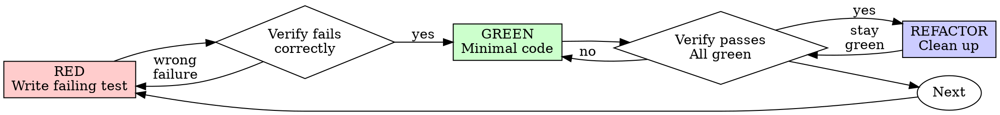

# Test-Driven Development — Python / pytest

## Overview

Write the test first. Watch it fail. Write minimal code to pass.

**Core principle:** If you didn't watch the test fail, you don't know if it tests the right thing.

**Violating the letter of the rules is violating the spirit of the rules.**

## When to Use

**Always:**
- New features
- Bug fixes
- Refactoring
- Behavior changes

**Exceptions (ask your human partner):**
- Throwaway prototypes
- Generated code
- Configuration files

Thinking "skip TDD just this once"? Stop. That's rationalization.

## The Iron Law

```
NO PRODUCTION CODE WITHOUT A FAILING TEST FIRST
```

Write code before the test? Delete it. Start over.

**No exceptions:**
- Don't keep it as "reference"
- Don't "adapt" it while writing tests
- Don't look at it
- Delete means delete

Implement fresh from tests. Period.

## Red-Green-Refactor



### RED - Write Failing Test

Write one minimal test showing what should happen. Group it in a class. Follow Arrange-Act-Assert with a Given/When/Then docstring.

<Good>
```python
class TestCalculateOrderTotal:
    @staticmethod
    def arrange_line_items(
        quantities: list[int],
        unit_prices: list[float],
    ) -> list[dict[str, float]]:
        """Create line items for the arrange phase.

        Parameters
        ----------
        quantities : list[int]
            Quantity ordered for each item.
        unit_prices : list[float]
            Unit price for each item.

        Returns
        -------
        list[dict[str, float]]
            Line items as dicts with 'qty' and 'price' keys.
        """
        return [{"qty": q, "price": p} for q, p in zip(quantities, unit_prices)]

    @staticmethod
    def assert_total_equals(result: float, expected: float) -> None:
        """Assert the calculated total matches the expected value.

        Parameters
        ----------
        result : float
            The calculated total.
        expected : float
            The expected total.
        """
        assert result == pytest.approx(expected), (
            f"Order total should be {expected}, got {result}"
        )

    def test_applies_discount_to_order_total(self) -> None:
        """Test applying discount to order total.

        Given two line items and a 10% discount.
        When calculating the order total.
        Then the total reflects the discounted sum of all items.
        """
        # Arrange
        line_items = self.arrange_line_items(
            quantities=[2, 1],
            unit_prices=[10.00, 5.00],
        )

        # Act
        result = calculate_order_total(line_items, discount_percent=10)

        # Assert
        self.assert_total_equals(result, expected=22.50)
```
Named helpers, real numbers, one behavior, clear name
</Good>

<Bad>
```python
def test_order_total() -> None:
    """Test order total."""
    result = calculate_order_total(
        [{"qty": 2, "price": 10.0}, {"qty": 1, "price": 5.0}], 10
    )
    assert result == 22.5
```
Standalone function, no helpers, vague docstring, magic numbers, no AAA, no assert message
</Bad>

**Requirements:**
- One behavior per test
- Class-based, never standalone functions
- Clear name describing the scenario
- NumPy docstring with Given/When/Then
- Arrange-Act-Assert structure
- Real code (no mocks unless unavoidable)

### Verify RED - Watch It Fail

**MANDATORY. Never skip.**

```bash
pytest tests/test_order.py::TestCalculateOrderTotal::test_applies_discount_to_order_total -v
```

Confirm:
- Test fails (not errors)
- Failure message is expected
- Fails because feature is missing (not typos)

**Test passes?** You're testing existing behavior. Fix the test.

**Test errors?** Fix the error, re-run until it fails correctly.

### GREEN - Minimal Code

Write the simplest code to pass the test.

<Good>
```python
from typing import Callable, TypeVar

T = TypeVar("T")


def retry_operation(fn: Callable[[], T]) -> T:
    for i in range(3):
        try:
            return fn()
        except Exception:
            if i == 2:
                raise
    raise RuntimeError("unreachable")
```
Just enough to pass
</Good>

<Bad>
```python
def retry_operation(
    fn: Callable[[], T],
    max_retries: int = 3,
    backoff: Literal["linear", "exponential"] = "linear",
    on_retry: Callable[[int], None] | None = None,
    timeout: float | None = None,
) -> T:
    # YAGNI - over-engineered before tests require it
    ...
```
Over-engineered
</Bad>

Don't add features, refactor other code, or "improve" beyond what the test requires.

### Verify GREEN - Watch It Pass

**MANDATORY.**

```bash
pytest tests/test_retry.py -v
```

Confirm:
- Test passes
- Other tests still pass
- Output pristine (no errors, warnings)

**Test fails?** Fix code, not test.

**Other tests fail?** Fix now.

### REFACTOR - Clean Up

After green only:
- Remove duplication
- Improve names
- Extract helpers

Keep tests green. Don't add behavior.

### Repeat

Next failing test for next feature.

## Python Test Structure

### Test Classes

Always group tests in a class. Never use standalone test functions.

<Good>
```python
class TestSubmitForm:
    def test_rejects_empty_email(self) -> None:
        ...

    def test_rejects_malformed_email(self) -> None:
        ...
```
</Good>

<Bad>
```python
def test_submit_form_rejects_empty_email() -> None:
    ...

def test_submit_form_rejects_malformed_email() -> None:
    ...
```
Standalone functions, no grouping
</Bad>

### Arrange-Act-Assert

Every test follows three explicit phases with section comments:

```python
def test_marks_order_as_complete(self) -> None:
    """Test processing a pending order marks it as complete.

    Given a pending order.
    When the order is processed.
    Then its status changes to 'complete'.
    """
    # Arrange
    order = make_order(status="pending")

    # Act
    result = process_order(order)

    # Assert
    assert result.status == "complete", "Processed order should have status 'complete'"
```

If Act is more than two lines, rethink your design.

### NumPy Docstrings with Given/When/Then

Every test method needs a docstring expressing the scenario as Given/When/Then. Omit Parameters and Returns sections when empty.

<Good>
```python
def test_rejects_expired_token(self) -> None:
    """Test that expired token raises error.

    Given a user token that has expired.
    When the token is validated.
    Then a TokenExpiredError is raised.
    """
```
</Good>

<Bad>
```python
def test_expired_token(self) -> None:
    """Test that expired token raises error."""
```
No Given/When/Then, vague description
</Bad>

### Parametrize

Use `@pytest.mark.parametrize` to eliminate duplication across scenarios. Remove magic numbers by naming them as parameters.

<Good>
```python
@pytest.mark.parametrize(
    "email,expected_error",
    [
        ("", "Email required"),
        ("not-an-email", "Email invalid"),
        ("a" * 256 + "@example.com", "Email too long"),
    ],
)
def test_rejects_invalid_email(
    self,
    email: str,
    expected_error: str,
) -> None:
    """Test that invalid email values are rejected.

    Given a form with an invalid email value.
    When the form is submitted.
    Then the appropriate validation error is returned.
    """
    # Arrange
    form_data = {"email": email}

    # Act
    result = submit_form(form_data)

    # Assert
    assert result["error"] == expected_error, (
        f"Email '{email}' should produce error '{expected_error}'"
    )
```
</Good>

<Bad>
```python
def test_empty_email(self) -> None:
    assert submit_form({"email": ""})["error"] == "Email required"

def test_bad_email(self) -> None:
    assert submit_form({"email": "not-an-email"})["error"] == "Email invalid"
```
Duplicated structure, magic strings, no docstring, no AAA, no message
</Bad>

Never parametrize to the point where the test loses clarity. If parameters require extensive explanation, split into named tests.

### Reusable Arrange Helpers

Extract repeated setup into helpers. Place them at the top of the test class (preferred), in the top of the test file (shared by multiple test classes), or in `conftest.py` (shared across multiple test files). Use keyword overrides to vary only what matters per test.

```python
def arrange_user(
    name: str = "Alice",
    email: str = "alice@example.com",
    role: str = "viewer",
) -> dict[str, str]:
    """Create a default user dict for test arrange phase.

    Parameters
    ----------
    name : str
        The name of the user.
    email : str
        The email of the user.
    role : str
        The role of the user.

    Returns
    -------
    dict[str, str]
        A dictionary representing the user with the given name, email, and role.
    """
    return {"name": name, "email": email, "role": role}
```

In tests:
```python
# Arrange - vary only what the scenario requires
admin = arrange_user(role="admin")
viewer = arrange_user(role="viewer")
```

### Reusable Assert Helpers

Extract repeated assertions into helpers that always provide clear failure messages:

```python
def assert_form_error(
    result: dict[str, object],
    field: str,
    expected_message: str,
) -> None:
    """Assert a validation error is present on the given field.

    Parameters
    ----------
    result : dict[str, object]
        The result dictionary returned from form submission.
    field : str
        The field name expected to have a validation error.
    expected_message : str
        The expected validation error message for the field.

    Raises
    ------
    AssertionError
        If the validation error is not present or does not match the expected message.
    """
    assert "errors" in result, "Result should contain an 'errors' dict"
    assert field in result["errors"], f"Field '{field}' should have a validation error"
    assert result["errors"][field] == expected_message, (
        f"Error for '{field}' should be '{expected_message}'"
    )
```

Every `assert` — inline or in helpers — must include a message explaining what is being tested.

### Mocking with pytest-mock

Use `mocker.patch` from `pytest-mock` to isolate from slow or external dependencies. Mock only what you must.

```python
from pytest_mock import MockerFixture
from unittest.mock import MagicMock


class TestRetryOperation:
    def test_sends_alert_on_exhausted_retries(self, mocker: MockerFixture) -> None:
        """Test that an alert is sent when retry_operation exhausts all attempts.

        Given an operation that always fails.
        When retry_operation exhausts all attempts.
        Then an alert is sent with the failure message.

        Parameters
        ----------
        mocker : MockerFixture
            The pytest-mock fixture for patching.
        """
        # Arrange
        mock_alert = mocker.patch("mymodule.send_alert")
        failing_op = MagicMock(side_effect=RuntimeError("connection refused"))

        # Act
        with pytest.raises(RuntimeError):
            retry_operation(failing_op)

        # Assert
        mock_alert.assert_called_once_with("Operation failed: connection refused")
```

Read @testing-anti-patterns.md before adding any mock. Mock at the lowest possible level. Real code is always preferred over mocks.

## Good Tests

| Quality            | Good                                | Bad                                              |
| ------------------ | ----------------------------------- | ------------------------------------------------ |
| **Minimal**        | One thing. "and" in name? Split it. | `test_validates_email_and_domain_and_whitespace` |
| **Clear name**     | Describes scenario                  | `test_1`, `test_retry_works`                     |
| **Class-based**    | `class TestSubmitForm`              | Standalone `def test_submit_form`                |
| **Docstring**      | Given/When/Then                     | Absent or one-liner                              |
| **AAA**            | Three labeled sections              | Mixed setup and assertions                       |
| **Assert message** | Every assert has a message          | Bare `assert x == y`                             |
| **Shows intent**   | Demonstrates desired API            | Obscures what code should do                     |

## Why Order Matters

**"I'll write tests after to verify it works"**

Tests written after code pass immediately. Passing immediately proves nothing:
- Might test wrong thing
- Might test implementation, not behavior
- Might miss edge cases you forgot
- You never saw it catch the bug

Test-first forces you to see the test fail, proving it actually tests something.

**"I already manually tested all the edge cases"**

Manual testing is ad-hoc. You think you tested everything but:
- No record of what you tested
- Can't re-run when code changes
- Easy to forget cases under pressure
- "It worked when I tried it" ≠ comprehensive

Automated tests are systematic. They run the same way every time.

**"Deleting X hours of work is wasteful"**

Sunk cost fallacy. The time is already gone. Your choice now:
- Delete and rewrite with TDD (X more hours, high confidence)
- Keep it and add tests after (30 min, low confidence, likely bugs)

The "waste" is keeping code you can't trust. Working code without real tests is technical debt.

**"TDD is dogmatic, being pragmatic means adapting"**

TDD IS pragmatic:
- Finds bugs before commit (faster than debugging after)
- Prevents regressions (tests catch breaks immediately)
- Documents behavior (tests show how to use code)
- Enables refactoring (change freely, tests catch breaks)

"Pragmatic" shortcuts = debugging in production = slower.

**"Tests after achieve the same goals - it's spirit not ritual"**

No. Tests-after answer "What does this do?" Tests-first answer "What should this do?"

Tests-after are biased by your implementation. You test what you built, not what's required. You verify remembered edge cases, not discovered ones.

Tests-first force edge case discovery before implementing. Tests-after verify you remembered everything (you didn't).

30 minutes of tests after ≠ TDD. You get coverage, lose proof tests work.

## Common Rationalizations

| Excuse                                 | Reality                                                                 |
| -------------------------------------- | ----------------------------------------------------------------------- |
| "Too simple to test"                   | Simple code breaks. Test takes 30 seconds.                              |
| "I'll test after"                      | Tests passing immediately prove nothing.                                |
| "Tests after achieve same goals"       | Tests-after = "what does this do?" Tests-first = "what should this do?" |
| "Already manually tested"              | Ad-hoc ≠ systematic. No record, can't re-run.                           |
| "Deleting X hours is wasteful"         | Sunk cost fallacy. Keeping unverified code is technical debt.           |
| "Keep as reference, write tests first" | You'll adapt it. That's testing after. Delete means delete.             |
| "Need to explore first"                | Fine. Throw away exploration, start with TDD.                           |
| "Test hard = design unclear"           | Listen to test. Hard to test = hard to use.                             |
| "TDD will slow me down"                | TDD faster than debugging. Pragmatic = test-first.                      |
| "Manual test faster"                   | Manual doesn't prove edge cases. You'll re-test every change.           |
| "Existing code has no tests"           | You're improving it. Add tests for existing code.                       |

## Red Flags - STOP and Start Over

- Code before test
- Test after implementation
- Test passes immediately
- Can't explain why test failed
- Tests added "later"
- Rationalizing "just this once"
- "I already manually tested it"
- "Tests after achieve the same purpose"
- "It's about spirit not ritual"
- "Keep as reference" or "adapt existing code"
- "Already spent X hours, deleting is wasteful"
- "TDD is dogmatic, I'm being pragmatic"
- "This is different because..."
- Standalone test functions instead of class methods
- Missing docstring or no Given/When/Then
- Assert without a message
- No Arrange-Act-Assert structure

**All of these mean: Delete code. Start over with TDD.**

## Example: Bug Fix

**Bug:** Empty email accepted

**RED**
```python
class TestSubmitForm:
    def test_rejects_empty_email(self) -> None:
        """Test that submitting a form with an empty email returns an error.

        Given a form submission with an empty email.
        When the form is submitted.
        Then an 'Email required' error is returned.
        """
        # Arrange
        form_data = {"email": ""}

        # Act
        result = submit_form(form_data)

        # Assert
        assert result["error"] == "Email required", (
            "Empty email should be rejected with 'Email required'"
        )
```

**Verify RED**
```bash
$ pytest tests/test_form.py::TestSubmitForm::test_rejects_empty_email -v
FAILED: AssertionError: 'Email required' not found — assert None == 'Email required'
```

**GREEN**
```python
def submit_form(data: dict[str, str]) -> dict[str, str]:
    """Submit a form and validate its fields.

    Parameters
    ----------
    data : dict[str, str]
        The form data to submit.

    Returns
    -------
    dict[str, str]
        A dictionary containing either an 'error' key with a validation message or other result data.
    """
    if not data.get("email", "").strip():
        return {"error": "Email required"}
    ...
```

**Verify GREEN**
```bash
$ pytest tests/test_form.py -v
PASSED
```

**REFACTOR**
Extract a `validate_form` function if multiple fields need validation.

## Verification Checklist

Before marking work complete:

- [ ] Every new function/method has a test
- [ ] Watched each test fail before implementing
- [ ] Each test failed for the expected reason (feature missing, not typo)
- [ ] Wrote minimal code to pass each test
- [ ] All tests pass
- [ ] Output pristine (no errors, warnings)
- [ ] Tests use real code (mocks only if unavoidable)
- [ ] Edge cases and errors covered
- [ ] All tests are in classes, not standalone functions
- [ ] Every test has a NumPy docstring with Given/When/Then
- [ ] Every test follows Arrange-Act-Assert with section comments
- [ ] Every `assert` includes a helpful failure message
- [ ] Parametrize used where duplication exists across scenarios
- [ ] Arrange and assert helpers extracted where setup is repeated
- [ ] No magic numbers — values are named via parametrize or helper defaults
- [ ] Type hints on all helpers and test methods

Can't check all boxes? You skipped TDD. Start over.

## When Stuck

| Problem                      | Solution                                                                     |
| ---------------------------- | ---------------------------------------------------------------------------- |
| Don't know how to test       | Write the wished-for API. Write the assertion first. Ask your human partner. |
| Test too complicated         | Design too complicated. Simplify the interface.                              |
| Must mock everything         | Code too coupled. Use dependency injection.                                  |
| Test setup huge              | Extract arrange helpers. Still complex? Simplify design.                     |
| Parametrize getting unwieldy | Too many dimensions. Split into focused named tests.                         |
| Assert message unclear       | Name matters. Restate what the business rule is, not the code detail.        |

## Debugging Integration

Bug found? Write a failing test reproducing it. Follow the TDD cycle. The test proves the fix and prevents regression.

Never fix bugs without a test.

## Testing Anti-Patterns

When adding mocks or test utilities, read @testing-anti-patterns.md to avoid common pitfalls:
- Testing mock behavior instead of real behavior
- Adding test-only methods to production classes
- Mocking without understanding dependencies
- Incomplete mock responses
- Over-complex mocks hiding design problems

## Final Rule

```
Production code → test exists and failed first
Otherwise → not TDD
```

No exceptions without your human partner's permission.
